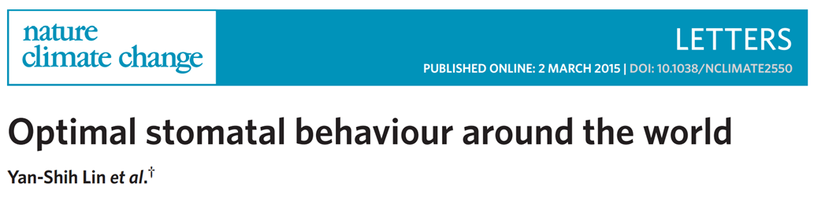
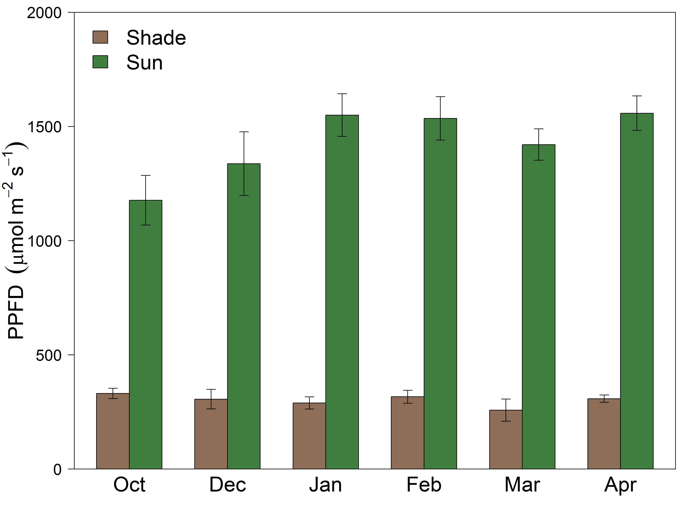
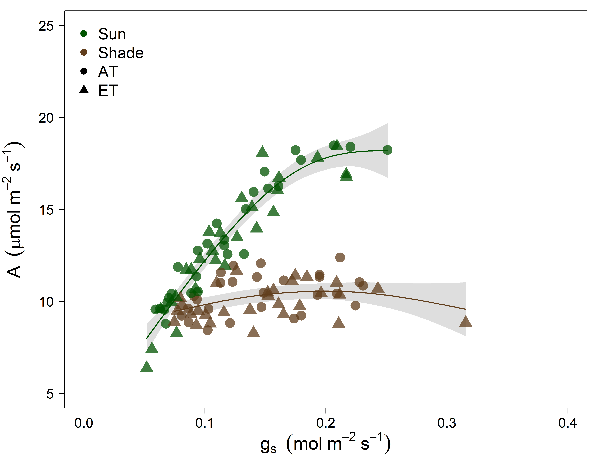
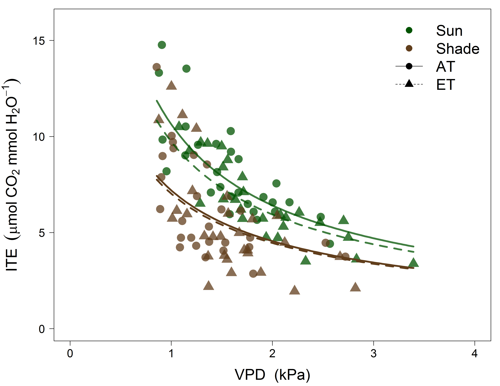

## Leaves are reported to have an optimized behavior

### They should act to maximize carbon gain while minimizing costs 

http://cc61877.github.io/wtc3_talk/index.html#1

--- .class #id bg:white
## However...

--- .class #id bg:white
## For the canopy...Don't LEAF things to chance

> - <strong>Trees can't put all leaves in the sun</strong>
>  - Drives changes in anatomy, morphology and physiology
>  - Affects canopy resource distribution

> - <strong>Photosynthetic capacity ↓ in shade leaves</strong>

---&twocol bg:white
## Photosynthesis is a diffusion process

 

***=left

 
- Driven by resistances to CO2 into leaves and then to the site of carboxylation
- Stomatal <strong>(gs)</strong> and mesophyll <strong>(gm)</strong> conductance both limit photosynthesis 

> - Limitations result from costs and tradeoffs
> - <strong>We know little about these relationships within canopies</strong> 

***=right

---&twocol bg:white
##  Leaves experience light fluctuations daily

 
 
***=left

***=right

> - <strong>Are shade leaves optimized for low light or to respond to occasional high light</strong>

> - Beyond just photosynthetic capacity

> - gs responds slowly

> - gm anatomicaly constrained

> - <strong>Unfortunately, not a enough empirical data available</strong>

---&twocol bg:white
## Sun and shade leaf physiology with the WTC3

***=right

 
> - <strong>12 whole tree chambers</strong>
>  - +3C ET treatments
>  - Minimal treatment effects found

> - <strong>Imposed drought in final months</strong>
>  - Focus on well watered trees 

> - <strong>Heaps of gas exchange over 6 months</strong>
>  - Sun and shade leaves
>  - Leaf temperature = air temperature
>  - Tunable diode laser for gm

---&twocol_left bg:white
## What's in a name? That which we call a ~~Rose~~ Leaf

***=right

 

> - <strong>Measuring two canopy extremes</strong>
>  - Sun: top of canopy in full light
>  - Shade: bottom and middle canopy in full shade
>  - Verified with quantum sensor and ceptometer

> - <strong>Leaves measured at current light environment</strong>
>  - Paired WTC compairsons
> - <strong>'Lights On' for shade leaves</strong>
>  - Max sunfleck response

---&twocol bg:white
##  Are tree canopies optimized for carbon gain?

 
***=left

> - <strong>Do light gradients define leaf properties</strong>
>   - Resources and photosynthetic capacity (<strong>Amax</strong>) should be <strong>↑</strong> in sun leaves

***=right

> - <strong>Is the canopy optimized to <strong>↑</strong> C gain while <strong>↓</strong> water loss?</strong>
>   - Then gs will be  proportional to photosynthesis across all leaves
 
> - <strong>What is the role of gm as its costs are less clear?</strong>
>   - If Amax is  in sun leaves then <strong>↑</strong>gm should be too

--- .class #id bg:white
## 75% reduction in direct light to shade leaves

--- &carousel bg:white 
## Photosynthetic capacity reduced in shade leaves

*** {class: active, img: "assets/img/white.png"}

*** {img: "assets/img/aci.png"}
Vcmax and Jmax <strong>↑</strong> in sun leaves

*** {img: "assets/img/photonitro.png"}
~25% higher Leaf Nitrogen in sun

--- .class #id bg:white
## Shade leaves exhibited wasteful water

--- .class #id bg:white
## <strong>↓</strong> WUE from sub-optimal behavior of gs

--- &carousel_nocap bg:white 
## Does the answer lie within sunflecks?

*** {class: active, img: "assets/img/ags1.png"}
Shade leaves = sun leaves

*** {img: "assets/img/agsbar.png"}
Do shade leaves 'lie in wait'?

---&twocol bg:white
## The need to investigate within the canopy

 

***=left

 
> - <strong>Can we reject the hypothesis that leaves are optimized throughout the canopy?</strong> 
>  - 
Sun leaves utlize higher N while minimizing water loss (&#10003;)

>  - 
gm proportional to photosynthesis... and also 'ready to go' (&#10003;)

>  - 
gs and photosynthesis decoupled in shade (&#10008;)
 

---&twocol_left bg:white
## Measuring shade leaves: Whats to gain?

 

***=right

 
> - <strong>Why are shade leaves wasting water?</strong>
>  - Leaves prepared to 'slow' response of gs?
>  - Economy of physiology
>  - <strong>↑</strong> water loss to potentially turn shade leaves into sun leaves?
>  - gm is the key

> - <strong>Implications for scaling leaf level measurments to the canopy</strong>

---.class #id bg:white

http://cc61877.github.io/wtc3_talk/index.html#1

--- .class #id bg:white
##  Mesophyll conductance and Photosynthesis

--- .class #id bg:white
## Cc and Photosynthesis

--- .class #id bg:white
## Leaf Ci from gas exchange higher in shade leaves

--- .class #id bg:white
## Ci from leaf δ13C higher in shade leaves

--- .class #id bg:white
## 'Lights On' stomatal conductance

