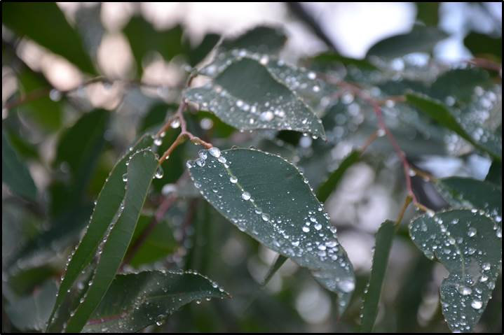
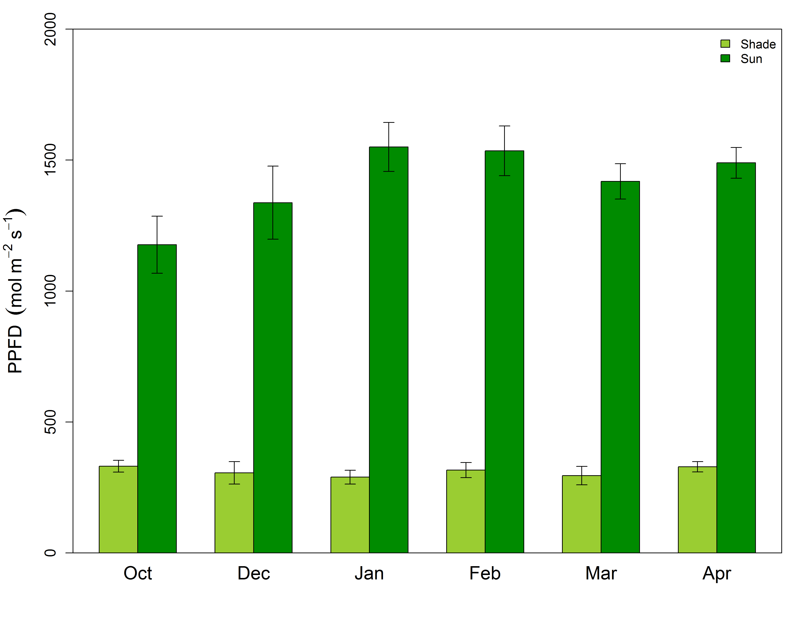
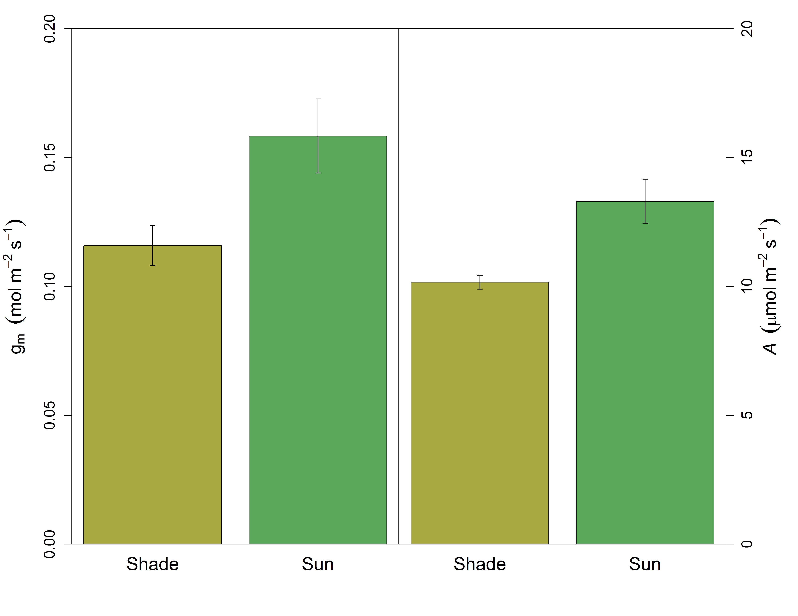
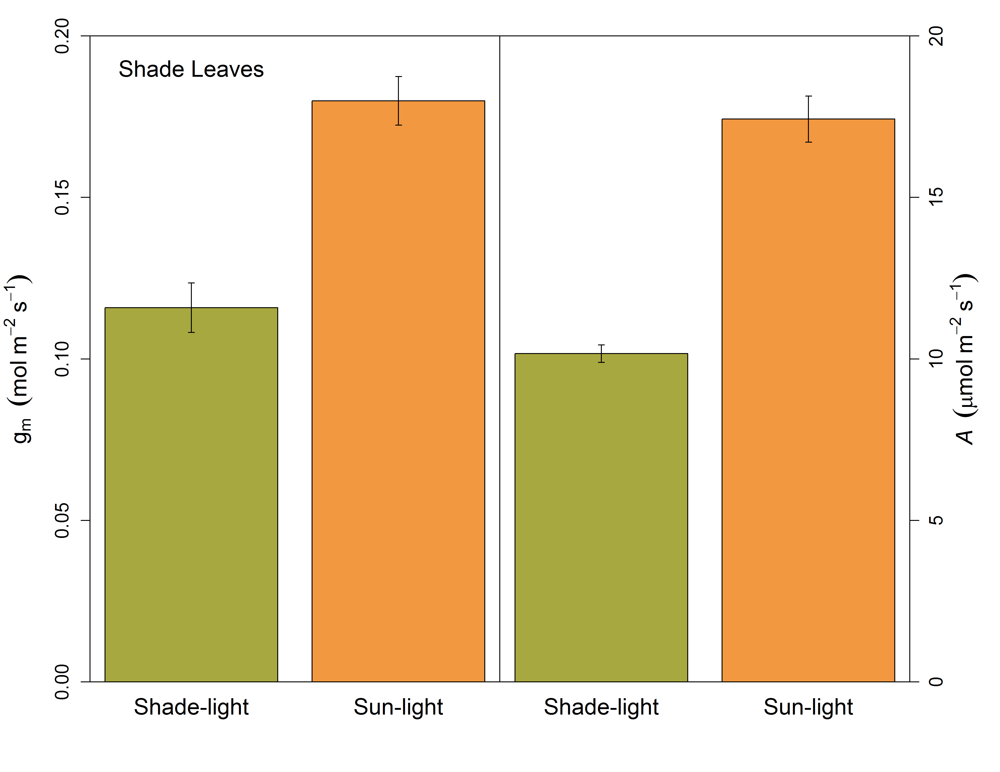
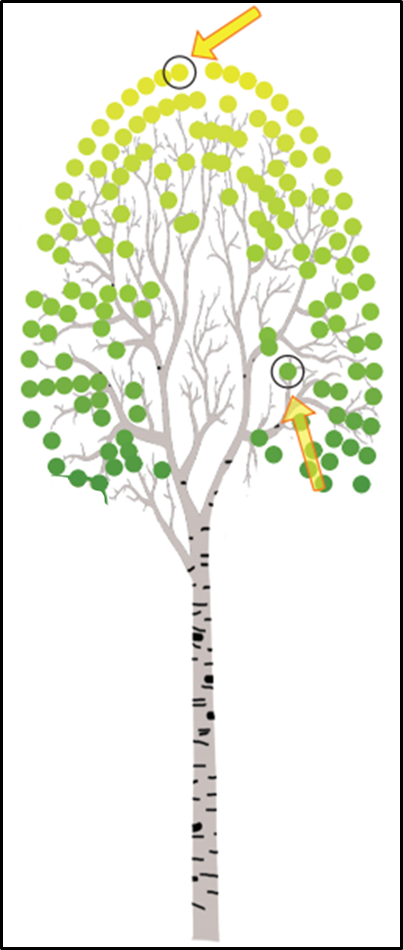
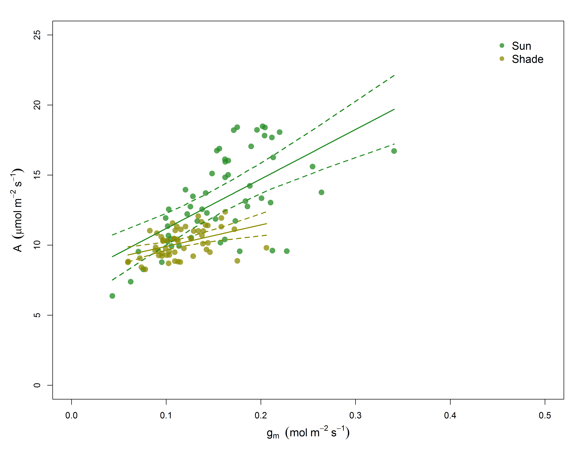
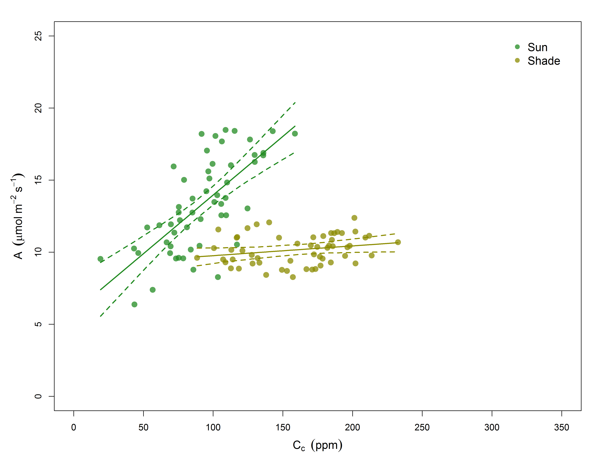
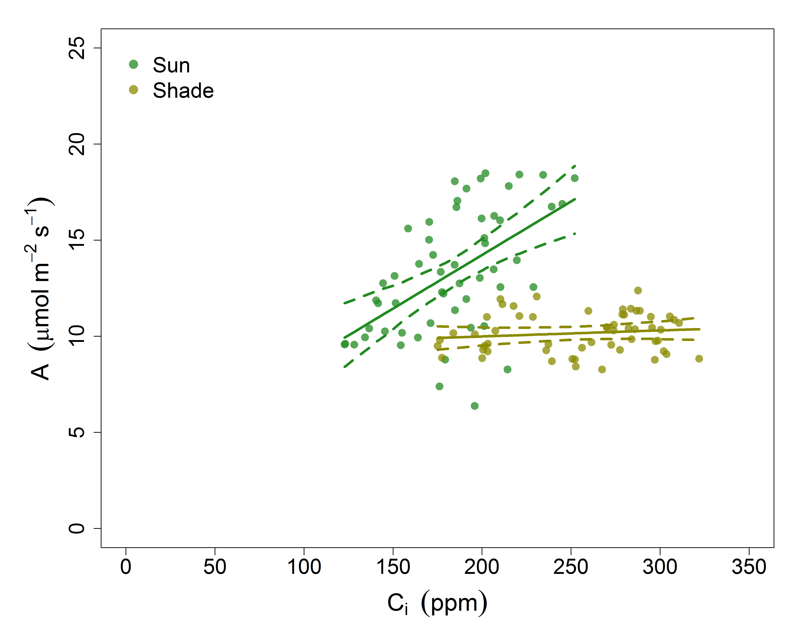
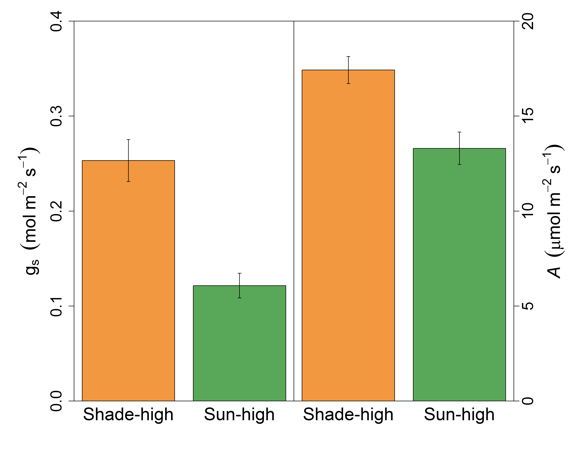

## Leaves are reported to have an optimized behavior

### They should act to maximize carbon gain while minimizing costs 

http://cc61877.github.io/wtc3_talk/index.html#1

--- .class #id bg:white
## However...

--- .class #id bg:white
## For the canopy...Don't LEAF things to chance

> - Trees can't put all leaves in the sun
>  - Drives changes in anatomy, morphology and physiology
>  - Affects canopy resource distribution

> - <strong>Photosynthetic capacity ↓ in shade leaves</strong>

---&twocol bg:white
## Photosynthesis is a diffusion process

 

***=left

 
- Driven by resistances to CO2 into leaves and then to the site of carboxylation
- Stomatal <strong>(gs)</strong> and mesophyll <strong>(gm)</strong> conductance both limit photosynthesis 

> - Limitations result from costs and tradeoffs
> - <strong>We know little about these relationships within canopies</strong> 

***=right

---&twocol bg:white
##  Are tree canopies optimized for carbon gain?

 
***=left

> - <strong>Do light gradients define leaf properties</strong>
>   - Photosynthetic capacity (<strong>Amax</strong>) and N should be <strong>↑</strong> in sun leaves

***=right

> - <strong>Is the whole canopy optimized to prevent water loss?</strong>
>   - Then gs will be  proportional to photosynthesis across all leaves
>   - Intercellular CO2 (Ci) should not differ between sun and shade leaves 
 
> - <strong>What is the role of gm as its costs are less clear?</strong>
>   - If Amax is <strong>↑</strong> in sun leaves then gm should be too
>   - Supply line of CO2 to the site of carboxylation 

---&twocol bg:white
## Sun and shade leaf physiology with the WTC3

***=right

 
> - <strong>12 tree chambers with 6 having elevated temperature treatment</strong>
>  - so far minimal treatment effects found

> - <strong>Imposed drought in final months</strong>
>  - focus on well watered trees 

> - <strong>Heaps of gas exchange over 6 months</strong>
>  - Sun and shade leaves
>  - Online discrimination with  TDL for gm

---&twocol_left bg:white
## What's in a name? That which we call a ~~Rose~~ Leaf

***=right

 

> - Measuring two extremes within a canopy
>  - Sun: top of canopy in full light
>  - Shade: bottom and middle canopy in full shade
>  - Verified with PAR sensor and ceptometer

> - Leaves measured at current light environment
>  - 'Lights On' for shade leaves

--- .class #id bg:white
## 75% reduction in direct light to shade leaves

--- &carousel bg:white 
## Photosynthesis reduced by ~40% in shade leaves

*** {class: active, img: "assets/img/white.png"}

*** {img: "assets/img/aci_sunsha.png"}
Vcmax and Jmax <strong>↑</strong> in sun leaves

*** {img: "assets/img/narea.png"}
~25% higher Leaf Nitrogen in sun

--- .class #id bg:white
## gm appears  acclimated to light environment

--- .class #id bg:white
## 'Lights On' stimulation of gm and photosynthesis 

--- &carousel_nocap bg:white 
## Photosynthesis and gs uncoupled in shade leaves

*** {class: active, img: "assets/img/photo_cond.png"}

*** {img: "assets/img/gsphoto_bar.png"}

---&twocol bg:white
## The need to investigate within the canopy

 

***=left

 
> - <strong>Can we reject the hypothesis that leaves are optimized throughout the canopy?</strong> 
>  - 
Sun leaves utlize higher N while minimizing water loss (&#10003;)

>  - 
gm proportional to photosynthesis... and also 'ready to go' (&#10003;)

>  - 
gs and photosynthesis decoupled in shade (&#10008;)
   

---&twocol_left bg:white
## Measuring shade leaves: Whats to gain?

 

***=right

 
> - <strong>Why are shade leaves wasting water?</strong>
>  - Are leaves prepared to 'slow' response of gs?
>  - Is this associated with water transport somewhere else?

> - <strong>Implications for models</strong>
>  - How general are these findings?
>  - Are we under/over predicting carbon gain or water use?

---.class #id bg:white

http://cc61877.github.io/wtc3_talk/index.html#1

--- .class #id bg:white
##  Mesophyll conductance and Photosynthesis

--- .class #id bg:white
## Cc and Photosynthesis

--- .class #id bg:white
## Leaf Ci from gas exchange higher in shade leaves

--- .class #id bg:white
## Ci from leaf δ13C higher in shade leaves

--- .class #id bg:white
## 'Lights On' stomatal conductance

